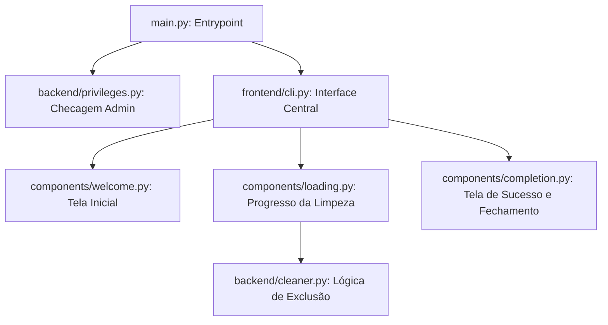

# Documentação de Funcionamento do WinCleaner

Esta documentação descreve detalhadamente a arquitetura, o fluxo de execução e a lógica interna do **WinCleaner**, um utilitário de alto desempenho para limpeza de arquivos temporários do Windows.

---

## 🛠️ Arquitetura Geral

O projeto segue uma arquitetura modular, dividida claramente entre a lógica de negócios (**Backend**) e a interface de console interativa (**Frontend**):

---

## 📂 Estrutura de Arquivos e Funções

### 1. Ponto de Entrada (`main.py`)
Responsável por orquestrar o ciclo de vida completo do aplicativo:
*   Inicializa e exibe a tela de boas-vindas.
*   Determina os privilégios do usuário. Se **não for administrador**, restringe a limpeza apenas à pasta temporária do usuário (`User Temp`). Se **for administrador**, habilita a limpeza do sistema e do `Prefetch`.
*   Chama a barra de progresso unificada e dispara a exclusão física dos arquivos.
*   Exibe a tela de encerramento com o total de bytes liberados.

### 2. Backend (`/backend`)

#### 📄 `backend/privileges.py`
Gerencia a detecção de privilégios elevados.
*   `is_admin()`: Usa a DLL do Windows `shell32.IsUserAnAdmin` para detectar se a execução possui privilégios de Administrador. Se executado em um ambiente sem suporte à chamada, retorna `False`.

#### 📄 `backend/cleaner.py`
Contém as regras de negócio para análise e exclusão física de arquivos e diretórios:
*   `get_temp_paths()`: Mapeia as pastas padrão do Windows:
    *   **User Temp**: `%TEMP%` (normalmente `C:\Users\<user>\AppData\Local\Temp`).
    *   **System Temp**: `C:\Windows\Temp`.
    *   **Prefetch**: `C:\Windows\Prefetch`.
*   `get_dir_size(path)`: Calcula recursivamente o tamanho total de um diretório em bytes utilizando varredura rápida (`os.scandir`).
*   `format_size(size_bytes)`: Formata bytes para unidades humanas legíveis (`B`, `KB`, `MB`, `GB`, `TB`).
*   `clean_directory(directory_path, progress_callback)`: Executa a exclusão de arquivos e subdiretórios com segurança:
    *   Arquivos abertos ou bloqueados pelo sistema/outros programas geram `PermissionError` e são **pulados silenciosamente** sem travar o aplicativo.
    *   Dispara um callback em tempo real para atualizar o progresso visual na interface.

---

### 3. Frontend (`/frontend`)

Implementado com foco em uma experiência estética inspirada nos guias da **Apple (Premium & Minimalist)** utilizando a biblioteca `rich`.

#### 📄 `frontend/cli.py`
Define a paleta de cores padrão monocromática com destaque azul (`accent`):
*   Tons brancos, pretos profundos e azul suave garantem alta legibilidade e um visual limpo e refinado.

#### 📄 `frontend/components/welcome.py`
*   Gera um painel com bordas arredondadas exibindo o título do programa de forma centralizada e limpa.
*   Aguardar qualquer tecla usando a captura direta de teclado do Windows (`msvcrt.getch()`).

#### 📄 `frontend/components/loading.py`
*   Varre previamente as pastas para calcular o número total aproximado de arquivos a serem deletados.
*   Inicia uma barra de carregamento fluida com animação de spinner (`dots`) e preenchimento gradual, atualizada dinamicamente a cada arquivo deletado no backend.

#### 📄 `frontend/components/completion.py`
*   Exibe uma caixa de sucesso verde arredondada contendo o total limpo.
*   Aguarda o input do usuário para sair.
*   **Fechamento Inteligente do Terminal (Windows)**:
    *   Após a leitura da tecla, o código detecta o handle do console atual usando `ctypes.windll.kernel32.GetConsoleWindow()`.
    *   Se um handle de janela for encontrado, envia de forma assíncrona um evento `WM_CLOSE` (`0x0010`) para a fila de mensagens da janela host com `ctypes.windll.user32.PostMessageW()`.
    *   Isso força o fechamento imediato e limpo da janela do PowerShell, CMD ou Windows Terminal que hospedou o aplicativo.

---

## 🚀 Fluxo de Execução Detalhado

O diagrama de atividades abaixo ilustra o comportamento passo a passo desde a inicialização do programa até o encerramento do processo:

```mermaid
sequenceDiagram
    actor Usuario
    participant Main as main.py
    participant Privs as backend/privileges.py
    participant Cleaner as backend/cleaner.py
    participant CLI as frontend/cli.py
    participant Completion as components/completion.py

    Usuario->>Main: Executa WinCleaner.exe
    Main->>CLI: show_welcome()
    CLI->>Usuario: Exibe painel inicial e aguarda tecla
    Usuario->>CLI: Pressiona tecla
    Main->>Privs: is_admin()
    Privs-->>Main: Retorna True/False (Admin Status)
    Main->>Cleaner: get_temp_paths()
    Cleaner-->>Main: Retorna caminhos disponíveis
    Main->>CLI: show_loading(paths_to_clean)
    rect rgb(30, 30, 40)
        Note over CLI, Cleaner: Loop de Limpeza e Progresso
        CLI->>Cleaner: clean_directory(path)
        Cleaner-->>CLI: Envia atualizações via progress_callback
    end
    Cleaner-->>Main: Retorna total de bytes limpos
    Main->>CLI: show_completion(total_formatted)
    CLI->>Completion: display_completion_screen()
    Completion->>Usuario: Exibe total limpo e pede tecla
    Usuario->>Completion: Pressiona tecla de saída
    Completion->>Completion: Executa GetConsoleWindow()
    alt Possui Console Ativo (Windows)
        Completion->>Completion: PostMessageW(hwnd, WM_CLOSE) [Fecha Terminal]
    end
    Completion->>Main: sys.exit(0)
```

---

## 📦 Compilação Automatizada

O arquivo `build.py` automatiza todo o empacotamento do utilitário utilizando o **PyInstaller**:
*   Instala automaticamente dependências presentes no `requirements.txt`.
*   Configura parâmetros de console (`--console`), arquivo único (`--onefile`), e nome personalizado (`--name=WinCleaner`).
*   O resultado final é depositado diretamente em `/dist/WinCleaner.exe`.
