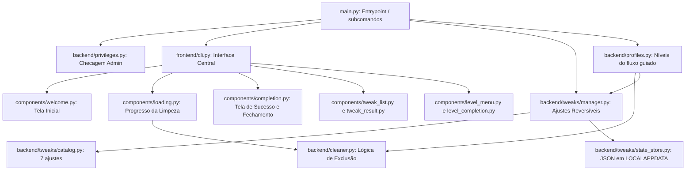
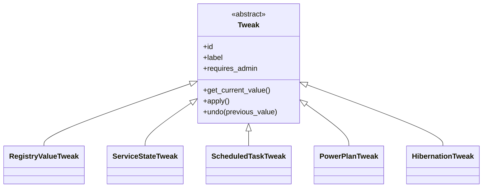
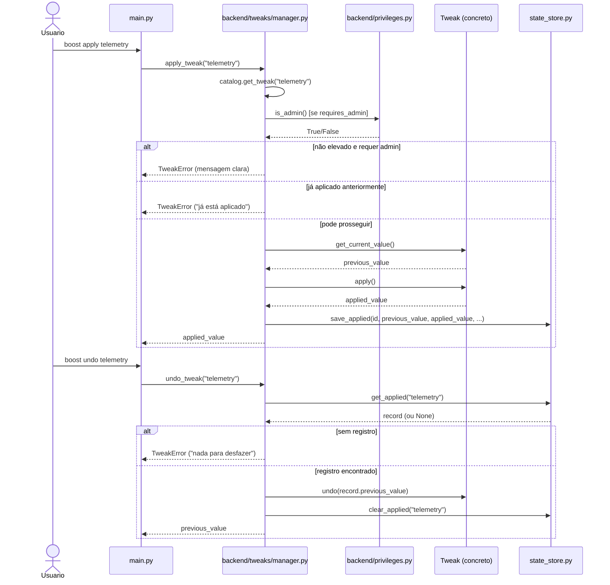
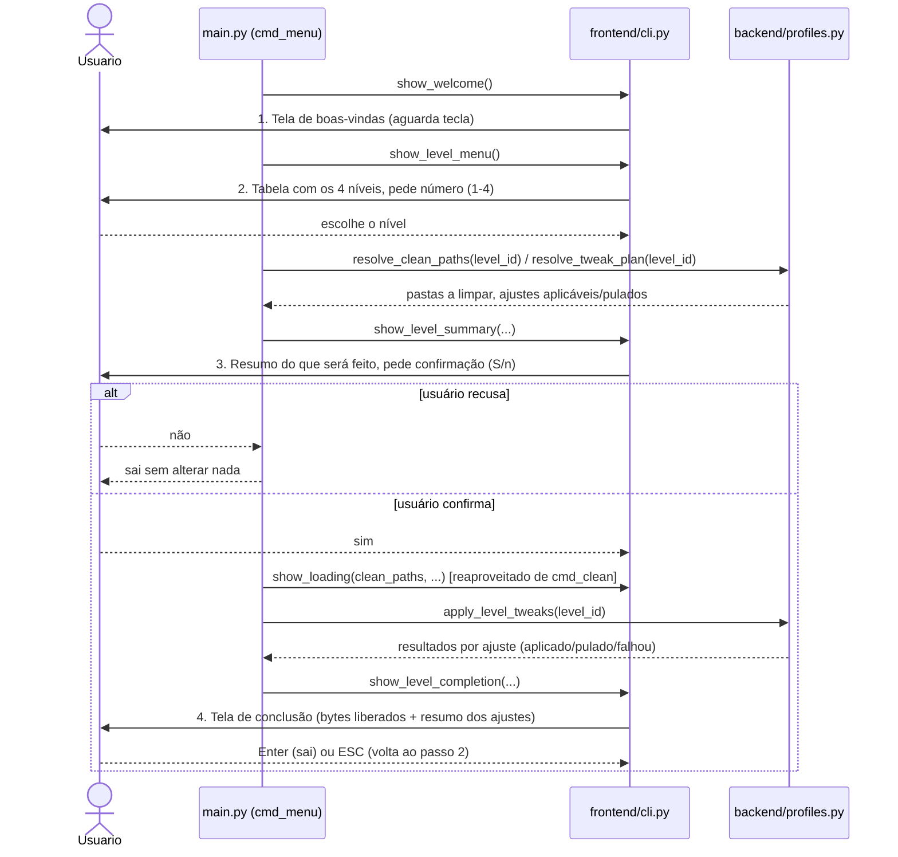

# Documentação de Funcionamento do WinCleaner

Esta documentação descreve detalhadamente a arquitetura, o fluxo de execução e a lógica interna do **WinCleaner**, um utilitário de alto desempenho para limpeza de arquivos temporários do Windows.

---

## 🛠️ Arquitetura Geral

O projeto segue uma arquitetura modular, dividida claramente entre a lógica de negócios (**Backend**) e a interface de console interativa (**Frontend**):



**`python main.py` sem argumentos agora abre o fluxo guiado (`menu`)** — o comando `clean` continua existindo para o comportamento direto de antes.

---

## 📂 Estrutura de Arquivos e Funções

### 1. Ponto de Entrada (`main.py`)
Responsável por orquestrar o ciclo de vida completo do aplicativo:
*   Inicializa e exibe a tela de boas-vindas.
*   Determina os privilégios do usuário. Se **não for administrador**, restringe a limpeza apenas à pasta temporária do usuário (`User Temp`). Se **for administrador**, habilita a limpeza do sistema e do `Prefetch`.
*   Chama a barra de progresso unificada e dispara a exclusão física dos arquivos.
*   Exibe a tela de encerramento com o total de bytes liberados.

### 2. Backend (`/backend`)

#### 📄 `backend/privileges.py`
Gerencia a detecção de privilégios elevados.
*   `is_admin()`: Usa a DLL do Windows `shell32.IsUserAnAdmin` para detectar se a execução possui privilégios de Administrador. Se executado em um ambiente sem suporte à chamada, retorna `False`.

#### 📄 `backend/cleaner.py`
Contém as regras de negócio para análise e exclusão física de arquivos e diretórios:
*   `get_temp_paths()`: Mapeia as pastas padrão do Windows:
    *   **User Temp**: `%TEMP%` (normalmente `C:\Users\<user>\AppData\Local\Temp`).
    *   **System Temp**: `C:\Windows\Temp`.
    *   **Prefetch**: `C:\Windows\Prefetch`.
*   `get_dir_size(path)`: Calcula recursivamente o tamanho total de um diretório em bytes utilizando varredura rápida (`os.scandir`).
*   `format_size(size_bytes)`: Formata bytes para unidades humanas legíveis (`B`, `KB`, `MB`, `GB`, `TB`).
*   `clean_directory(directory_path, progress_callback)`: Executa a exclusão de arquivos e subdiretórios com segurança:
    *   Arquivos abertos ou bloqueados pelo sistema/outros programas geram `PermissionError` e são **pulados silenciosamente** sem travar o aplicativo.
    *   Dispara um callback em tempo real para atualizar o progresso visual na interface.

---

### 3. Frontend (`/frontend`)

Implementado com foco em uma experiência estética inspirada nos guias da **Apple (Premium & Minimalist)** utilizando a biblioteca `rich`.

#### 📄 `frontend/cli.py`
Define a paleta de cores padrão monocromática com destaque azul (`accent`):
*   Tons brancos, pretos profundos e azul suave garantem alta legibilidade e um visual limpo e refinado.

#### 📄 `frontend/components/welcome.py`
*   Gera um painel com bordas arredondadas exibindo o título do programa de forma centralizada e limpa.
*   Aguardar qualquer tecla usando a captura direta de teclado do Windows (`msvcrt.getch()`).

#### 📄 `frontend/components/loading.py`
*   Varre previamente as pastas para calcular o número total aproximado de arquivos a serem deletados.
*   Inicia uma barra de carregamento fluida com animação de spinner (`dots`) e preenchimento gradual, atualizada dinamicamente a cada arquivo deletado no backend.

#### 📄 `frontend/components/completion.py`
*   Exibe uma caixa de sucesso verde arredondada contendo o total limpo.
*   Aguarda o input do usuário para sair.
*   **Fechamento Inteligente do Terminal (Windows)**:
    *   Após a leitura da tecla, o código detecta o handle do console atual usando `ctypes.windll.kernel32.GetConsoleWindow()`.
    *   Se um handle de janela for encontrado, envia de forma assíncrona um evento `WM_CLOSE` (`0x0010`) para a fila de mensagens da janela host com `ctypes.windll.user32.PostMessageW()`.
    *   Isso força o fechamento imediato e limpo da janela do PowerShell, CMD ou Windows Terminal que hospedou o aplicativo.

---

## 🚀 Fluxo de Execução Detalhado

O diagrama de atividades abaixo ilustra o comportamento passo a passo desde a inicialização do programa até o encerramento do processo:

```mermaid
sequenceDiagram
    actor Usuario
    participant Main as main.py
    participant Privs as backend/privileges.py
    participant Cleaner as backend/cleaner.py
    participant CLI as frontend/cli.py
    participant Completion as components/completion.py

    Usuario->>Main: Executa WinCleaner.exe
    Main->>CLI: show_welcome()
    CLI->>Usuario: Exibe painel inicial e aguarda tecla
    Usuario->>CLI: Pressiona tecla
    Main->>Privs: is_admin()
    Privs-->>Main: Retorna True/False (Admin Status)
    Main->>Cleaner: get_temp_paths()
    Cleaner-->>Main: Retorna caminhos disponíveis
    Main->>CLI: show_loading(paths_to_clean)
    rect rgb(30, 30, 40)
        Note over CLI, Cleaner: Loop de Limpeza e Progresso
        CLI->>Cleaner: clean_directory(path)
        Cleaner-->>CLI: Envia atualizações via progress_callback
    end
    Cleaner-->>Main: Retorna total de bytes limpos
    Main->>CLI: show_completion(total_formatted)
    CLI->>Completion: display_completion_screen()
    Completion->>Usuario: Exibe total limpo e pede tecla
    Usuario->>Completion: Pressiona tecla de saída
    Completion->>Completion: Executa GetConsoleWindow()
    alt Possui Console Ativo (Windows)
        Completion->>Completion: PostMessageW(hwnd, WM_CLOSE) [Fecha Terminal]
    end
    Completion->>Main: sys.exit(0)
```



---

## 🔄 Ajustes Reversíveis (`backend/tweaks/`)

Subsistema que aplica e desfaz ajustes do Windows (plano de energia, hibernação, efeitos visuais, telemetria, indexação, SysMain, tarefa de compatibilidade), sempre salvando o valor anterior antes de sobrescrever.

### Abstração `Tweak`

Diferente do resto do backend (só funções), aqui é usada uma classe abstrata (`abc.ABC`) porque os 7 ajustes têm mecanismos bem diferentes entre si e precisam de polimorfismo real — uma subclasse que esquecer `undo()` falha na hora de definir a classe, não silenciosamente na hora que o usuário mais precisa que o undo funcione.



As classes são organizadas por **mecanismo** (como falam com o Windows), não uma por ajuste — `RegistryValueTweak` atende tanto `visual_effects` quanto `telemetry`; `ServiceStateTweak` atende tanto `indexing` (WSearch) quanto `sysmain` (SysMain).

### Os 7 ajustes (`backend/tweaks/catalog.py`)

| id | admin? | leitura (locale-safe) | escrita | valor salvo para undo |
|---|---|---|---|---|
| `power_plan` | não | `winreg` `ActivePowerScheme` | `powercfg /setactive` | GUID do plano anterior |
| `hibernation` | sim | `winreg` `HibernateEnabled` | `powercfg /hibernate off` | 0/1 |
| `visual_effects` | não | `winreg` (HKCU) `VisualFXSetting` | mesma chave | int ou `null` |
| `telemetry` | sim | `winreg` `AllowTelemetry` | mesma chave | int ou `null` (undo apaga o valor se estava ausente) |
| `indexing` | sim | `winreg` `Services\WSearch\Start` | `sc config` + `sc stop` | tipo de start (string) |
| `sysmain` | sim | `winreg` `Services\SysMain\Start` | `sc config` + `sc stop` | tipo de start (string) |
| `compat_appraiser` | sim | `schtasks /Query /XML` | `schtasks /Change` | `"Enabled"`/`"Disabled"` |

**Leituras usam `winreg`, não parsing de saída de `.exe`** — a saída de `sc.exe`/`schtasks.exe`/`powercfg.exe` é localizada no idioma do Windows (esta interface é pt-BR, então o risco é real). Escritas continuam usando os `.exe`s porque as flags de linha de comando são fixas, não traduzidas. Um detalhe descoberto durante o desenvolvimento: `schtasks /XML` declara `encoding="UTF-16"` no prólogo do XML, mas os bytes capturados via pipe redirecionado são, na prática, UTF-8 — `scheduled_tasks.py` decodifica como texto (UTF-8) antes de entregar ao `ElementTree`, em vez de deixar o `ET.fromstring` confiar numa declaração que não bate com os bytes reais.

### Persistência de estado (`backend/tweaks/state_store.py`)

Arquivo JSON em `%LOCALAPPDATA%\WinCleaner\tweaks_state.json`, escrita atômica (arquivo temporário + `os.replace`). Um registro por `tweak_id` (não é um log de eventos):

```json
{
  "_schema_version": 1,
  "_next_seq": 2,
  "tweaks": {
    "telemetry": {
      "tweak_id": "telemetry",
      "applied_at": "2026-09-23T18:05:02-03:00",
      "previous_value": null,
      "applied_value": 0,
      "requires_admin": true,
      "_seq": 2
    }
  }
}
```

`previous_value: null` é um valor significativo (a chave/valor não existia antes) — `undo()` **apaga** o valor do registro em vez de escrever `null`. Reaplicar um ajuste já aplicado (sem desfazer antes) é **rejeitado**, nunca sobrescrito — sobrescrever destruiria o valor original verdadeiro. `_seq` é um contador interno usado para ordenar `boost undo --all` do mais recente para o mais antigo, independente de resolução do relógio do sistema.

### Fluxo de `apply` / `undo` (`backend/tweaks/manager.py`)



**Admin: falha clara, nunca auto-elevação via UAC.** Se um ajuste exige admin e o terminal não está elevado, `manager.py` levanta `TweakError` com mensagem pedindo para reabrir como Administrador — não tenta relançar o processo elevado. Isso mantém `--yes`/uso automatizado viável e evita um prompt de elevação surpresa, coerente com o princípio de "sem login/conta/telemetria própria" do projeto.

`boost list`/`boost apply <id>`/`boost undo <id>|--all` são os subcomandos novos em `main.py` (via `argparse.add_subparsers()`); `python main.py --dry-run -y` sem palavra-chave de subcomando continua funcionando como antes (implica `clean`).

---

## 🧭 Fluxo Guiado (`menu`) — comportamento padrão

Quando `python main.py` é executado sem argumentos, o subcomando `menu` é implícito e apresenta um fluxo guiado por 4 telas:



Na tela de conclusão (passo 4), **Enter** (ou qualquer tecla além de ESC) encerra o programa — fechando o terminal, igual ao `clean` — e **ESC** volta direto para o menu de níveis (passo 2), sem repetir a tela de boas-vindas, permitindo escolher outro nível na mesma sessão.

### Os 4 níveis (`backend/profiles.py`)

| Nível | Pastas limpas | Ajustes aplicados |
|---|---|---|
| Leve | User Temp | `visual_effects` |
| Mediana | + System Temp | + `power_plan` |
| Alta | + Prefetch | + `hibernation`, `indexing` |
| Extrema | (mesmas de Alta) | + `telemetry`, `sysmain`, `compat_appraiser` |

Cada nível é só uma lista declarativa de pastas + ids de ajustes em `profiles.LEVELS` — nenhuma lógica nova de limpeza ou de ajuste é criada; `resolve_clean_paths()` reaproveita `cleaner.get_temp_paths()` e o mesmo filtro por admin que `cmd_clean` já tinha, e `apply_level_tweaks()` reaproveita `tweaks.manager.apply_tweak()` ajuste por ajuste.

**Degradação graciosa, igual ao `clean`**: se o terminal não está elevado, ajustes que exigem admin (e pastas que exigem admin) são automaticamente pulados — nunca travam a execução do nível inteiro. A tela de resumo (passo 3) já mostra separadamente o que vai rodar e o que vai ser pulado por falta de admin, antes de qualquer coisa ser alterada; a tela de conclusão (passo 4) reporta quantos ajustes foram aplicados, pulados e (se algum já estava aplicado de uma execução anterior) quantos falharam.

A tela de conclusão do `menu` reaproveita o mesmo mecanismo de "aguardar tecla + fechar terminal" (`WM_CLOSE`) que o `clean` já usa — foi extraído para `frontend/components/_terminal.py` para não duplicar essa lógica. `list`/`apply`/`undo` continuam sem essa cerimônia, já que são pensados para rodar em sequência num terminal já aberto.

---

## 📦 Compilação Automatizada

O arquivo `build.py` automatiza todo o empacotamento do utilitário utilizando o **PyInstaller**:
*   Instala automaticamente dependências presentes no `requirements.txt`.
*   Configura parâmetros de console (`--console`), arquivo único (`--onefile`), e nome personalizado (`--name=WinCleaner`).
*   O resultado final é depositado diretamente em `/dist/WinCleaner.exe`.
